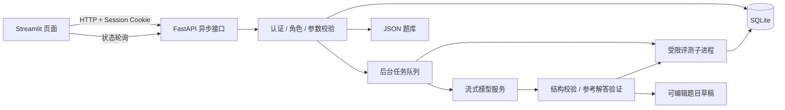

# 设计说明

## 数据流

## 持久化与任务生命周期

`Store` 使用 SQLite WAL 和按类别分组的 JSON 记录，减少初学者需要理解的 ORM 概念。题目另存为逐题 JSON，可读、可导入。写入临时文件后原子替换，避免写到一半破坏题目文件。

提交时复制题目与语言配置，避免排队期间的编辑影响本次判题。每个测试点 10 分，满分为测试点数乘 10。通过题数按题目去重、根据当前提交结果计算，重测后统计同步变化。

`pending → success` 表示流程正常完成，包括 WA、TLE、MLE、RE、CE 等结论；`pending → error` 表示执行器不可用或任务级异常。编译失败不等于任务级系统错误。编译失败时总分为 0，测试点统一记为 CE。

管理员重测覆盖原提交记录，重新获取当前题目与语言快照。正在评测的任务返回 409，避免重测与旧结果互相覆盖。关闭服务会取消子进程；重启后重新安排数据库中 pending 的普通提交。未完成的 AI 任务在启动时标记失败，避免重启自动造成新的模型消费。

## 身份与异常顺序

认证中间件先验证登录、禁用状态和管理员权限，再交给请求模型校验。接口再执行频率、冲突和资源存在性判断，覆盖课程给出的优先顺序。普通用户指定别人的用户编号时先返回 403。

密码使用 bcrypt；会话 Cookie 为随机 32 字节的 URL 安全字符串，服务器存储会话标识的 SHA-256 摘要。每次请求读取当前用户角色，修改权限立即生效。客户端隐藏管理员入口只是界面优化，不代替后端权限检查。

## 输出比较与资源限制

输出比较只移除行末空格/Tab、兼容 CRLF、移除最后多余换行；保留行首空格、行内空格和内部空行。使用 `split()` 比较全部单词会错误放宽格式要求，因此未采用。

异步读取 stdout/stderr 避免管道堵塞；限制收集大小，避免无限打印撑爆服务器内存。每个测试点独立启动程序并输入测试数据。超时和中断的清理流程放在 finally 中，Windows 通过 Job Object 清理整棵子进程树，Linux 终止进程组。

Windows Job Object 内存为提交量/进程树限制，RSS 监测与 Linux 地址空间限制的口径并不相同，因此统计是教学用途的近似值，而非竞赛级跨平台统一计量。示例与自动测试已覆盖常见的分配超限情况。

## AI 质量与可控性

模型配置按用户隔离，加密密钥与普通用户响应分开。每次任务使用创建时的配置快照；后续修改配置不改变已运行任务。模型请求不继承环境中的 HTTP 代理，不跟随重定向，失败消息只包含通用说明和 HTTP 状态，不回显提供商响应体。

JSON 模型强制完整结构；测试点必须至少有 8 种输入；参考程序要通过所有样例和测试点；验证失败最多追加一次修订请求。任务整体限时 300 秒，连接与流式读操作另有限时。

参考程序和期望输出由同一模型生成，运行一致不能证明两者独立正确；测试数量也不能证明边界或复杂度覆盖充分。因此系统展示覆盖说明、算法解释、测试点和参考程序供教师审阅，成功草稿必须经编辑页面保存后才进入题库。

## 已知扩展点

- 课程要求允许所有登录用户读取完整题目和编辑任意题目；正式比赛需要改变该权限模型。
- 当前单进程 SQLite/队列面向课程规模；多实例部署需共享队列、事务化状态机与独立执行器。
- 本地受限子进程不能隔离任意恶意代码；面向公网应使用隔离主机及强化沙箱。
- Docker 模式已提供实现和镜像定义，当前机器没有 Docker，未完成该模式的运行验证。
- 实际模型效果取决于用户配置的服务和模型，自动测试不声称替代真实模型质量评审。
